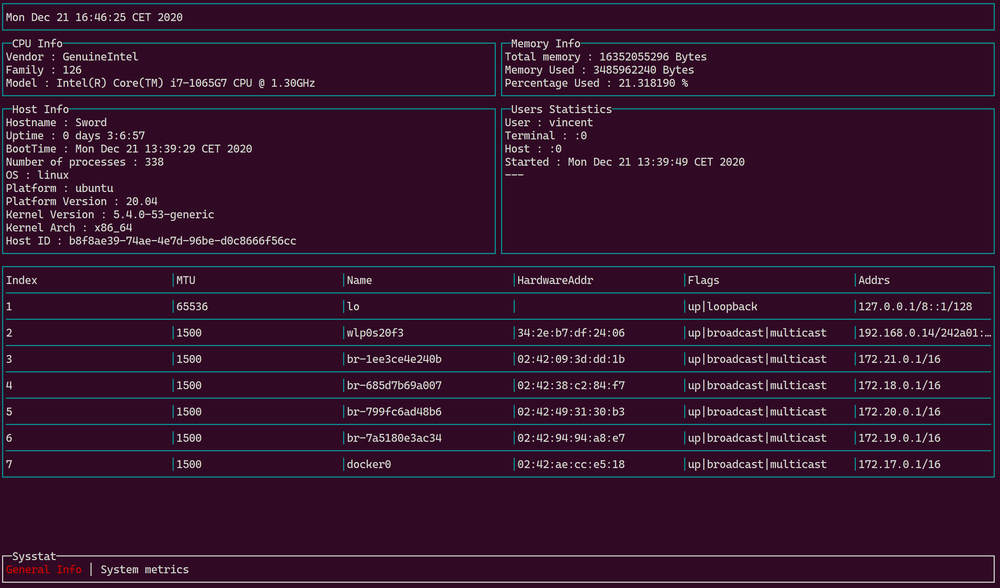
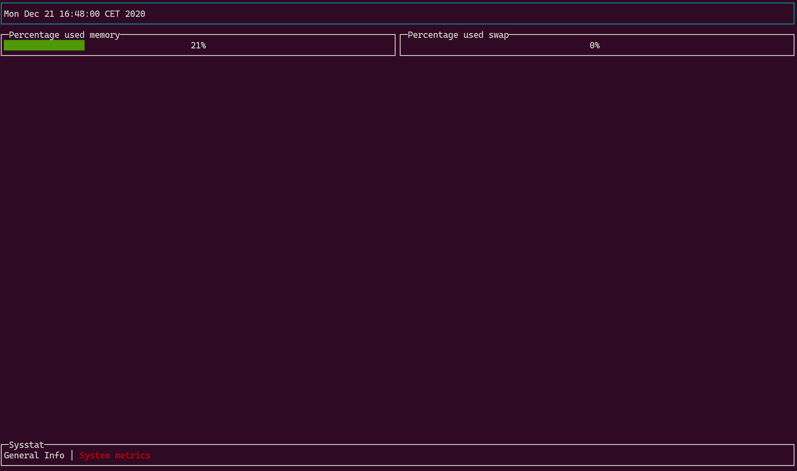

# Sysstat

Another system management for *nix (Linux, Freebsd). For the moment, only Linux is supported but Freebsd will be also supported.

## What is works ?

Currently, Sysstat can obtain and display information about your system (network interface, information about OS, memory, CPU and Informations about connected users). Because a screenshot is better than an long speech :



The second panel is the monitoring panel, currently only memory and swap usage has been added :



## How to install

You have to build the project, for do that :

```
# clone my repo on your computer
git clone https://github.com/VincentDrevet/Sysstat

# Install dependencies
go get github.com/gizak/termui/v3
go get github.com/gizak/termui/v3/widgets
go get github.com/wayneashleyberry/terminal-dimensions
go get github.com/shirou/gopsutil

# Build the Sysstat

cd <Sysstat>
go build Sysstat.go utils.go


```

## Keyboard shortcut

```
    <left arrow> / <right arrow> : Change pannel
    <q> or <Ctrl - c> : exit
```


# Thanking :

Thanks to **Zack Guo** for his tui lib (termui) https://github.com/gizak/termui

Thanks to **Wayne Ashley Berry** for his lib to obtain terminal size https://github.com/wayneashleyberry/wayneashleyberry.com

Thanks to **shirou** for the gopsutil lib that permit extract information about system https://github.com/shirou/gopsutil